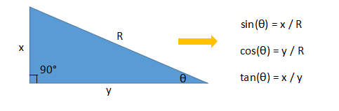

## 勾股定理
勾股定理是一个基本的几何定理，指直角三角形的两条直角边的平方和等于斜边的平方。


``` md
 h^2 = a^2 + b^2
```
## 三角函数

什么是三角函数呢？我给他了一个简单的定义：所谓三角函数，在几何上来说就是夹角与边的关系！为了更直观，也为了让忘记的同学回忆起来，这里我给个示意图：


在上图中我示例出了几个常用的三角函数，角度与边（x, y和R）之间的关系！那么在canvas中角度与边之间的关系是怎样的呢？


如图所示，普通坐标与canvas坐标是不同的，canvas坐标以左上角作为坐标原点，y轴朝下为正。

那么坐标不同，对应的角度表示就会有所差异，这个差异主要体现在角度的正负，千言万语不如一图：


好了，这就是在canvas中角度的正负表示。

前面我们简单的介绍了三角函数的表示方法，知道了三角函数表示的是角度与边之间的关系，但是在实际开发中我们不仅想要通过角度来推出两边的距离长度比值，而更关心的是如何通过已知的距离(因为坐标的位置很好确定)来推出角度。那么，应该如何做呢？这里我们要用到反三角函数


那么对应到，javascript中的相应表示方法是什么呢？这里做个小的归纳：


这里需要强调的是在canvas中采用的是弧度制。这样你就可以理解 θ * Math.PI/180是将角度转成弧度，比如：30° = 30 * π /180 = π / 6。 而将弧度转成角度自然就要用弧度值`Math.asin(x/R) 乘上180/Math.PI`。

极坐标系和单位圆 在笛卡尔直角坐标系中，任一点 (x, y) 都可以转化成极坐标表示 (r,θ)，其中


```  md
r = Math.sqrt(x^2 + y^2)
θ = Math.atan2(y, x)
```

### Math.atan2(dy, dx)
有一个重点要讲的函数，Math.atan(...)这个函数，他可以直接通过两个直角边得到角度值，相比于其他两个需要通过计算长边来得到角度值来说，是不是更酷了！但是它有个问题，因为这个arctan这个函数的特性(这里就不细讲了)它会导致一个很重要的问题，上图：


简单的说，就是使用Math.atan(...)你会得到两个相同的角度值，而电脑是无法判断你到底是转的哪个角度！！！这时，另一个函数就横空出世了，当当当当，他就是Math.atan2(dy, dx)!他不仅解决了上面我们说的问题，而且只需要传入两个横纵坐标距离！是不是很酷。

<!-- 单位圆的定义是半径为单位长度的圆，圆上任意一点的横坐标就是对应角度的余弦值，任意点的纵坐标就是对应角度的正弦值。

 -->
## 图像变换

简单的图像变换 以正弦曲线为例，对函数进行简单的变换，得到不一样的结果。

正弦曲线公式：y = A sin(Bx + C) + D

A 控制振幅，A 值越大，波峰和波谷越大，A 值越小，波峰和波谷越小；

B 值会影响周期，B 值越大，那么周期越短，B 值越小，周期越长。

C 值会影响图像左右移动，C 值为正数，图像左移，C 值为负数，图像右移。

D 值控制上下移动。

这个公式非常有用，如果下文的代码让你不解，记得回来查看注解。

简单得回顾一下之后，确保你还记得这些基础知识，那么这些曾经被得滚瓜烂熟的内容，和前端代码结合会变成什么样？