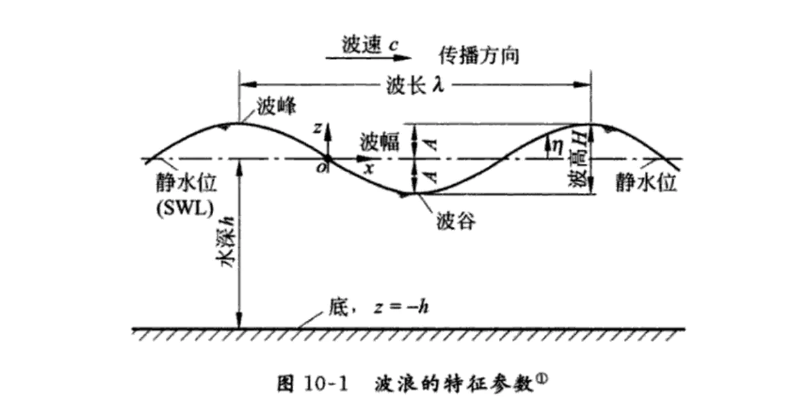

# 图像应用

##  Wave 曲线

<!-- <profile-panel :info="info"></profile-panel> -->
最直观的应用是使用三角函数来绘制 Wave 曲线
```js
for (let x = 0; x < width; x++) {
 const y = Math.sin(x * a) * amplitude
}
```
<sin-panel/>
曲线绘制完，这时曲线是静态的，如何让它动起来？可以通过不断改变水平偏移（xOffset），让曲线水平移动，即可产生动态的效果。

结合三角函数偏移让左右成为波谷，中间成为波峰，就能得到曼妙的波纹。
```js
for (let x = 0; x < width; x++) {
  const radians = x / width * Math.PI * 2
  const scale = (Math.sin(radians - Math.PI * 0.5) + 1) * 0.5
  const y = Math.sin(x * 0.02 + xSpeed) * amplitude * scale
}
```
<sin-run-panel/>

## 水波图
<WaterWavePanel/>
了解了正弦曲线的一些属性，我们可以把这些属性来控制波浪，



振幅：控制波浪的高度

周期：控制波浪的宽度

相移：控制波浪的水平移动

垂直位移：控制水位的高度

动画效果的实现主要是利用相移，通过不断水平移动曲线，产出波浪移动的感觉，然后可以绘制多条曲线，曲线之间通过控制属性（高度、宽度、移动速度），产生视觉差，就会有波浪起伏的感觉了。

根据定义波浪的参数配置，通过公式： y = 波浪高度 * sin(x * 波浪宽度 + 水平位移)，来绘制正弦曲线
#### 水位控制
水位控制，也就是映射到数据的百分比。
我们来看看：y = A sin(Bx + C) + D，曲线的高度有 A 和 D 决定，A 控制波浪的高度，实际水位还是由 D 来控制。
水位的高度，在可视化上含义就是数据的百分比，假设目前的百分比80%，水位的高度就 canvasHeight * 0.8，映射到坐标系统 y 的坐标就是 canvasHeight * (1 - 0.8)。（坐标原点在左上角）。


## SlowInSlowOut
正余弦曲线有很自然地缓入缓出的特性，并且在一个周期里面从 -1 到 1 再回到 -1，非常适合用来模拟一些物理效果。因为真实世界里面，汽车都是缓慢启动，加速，减速，再缓慢减速直到速度变为 0 的，突变会让人很难受。左边的摆球是线性匀速摆动，右边是用了三角函数优化的结果。
<SlowInSlowOut/>
只需使用 sin 或 cos 乘以最大角度，就可以得到在摆动最大角度之间的 SlowInSlowOut。
```js
ctx.rotate(Math.cos(t / 180 * Math.PI) * Math.PI * 0.25)
```

## 角度控制
在开发过程中，我们有时候会跟角度打交道，比如在头像左上角（45deg）显示 Notification 红点，用鼠标控制 rotation 等等。
运用三角函数，控制坐标的旋转，公式：
```js
dx = mouse.x - object.x; 
dy = mouse.y - object.y; 
object.rotation = Math.atan2(dy,dx); 
```
<Arrow/>

<!-- ## SadMan -->
<!-- <ManPanel/> -->
<script>
export default {
  data() {
      return {
      }
  }
}
</script>